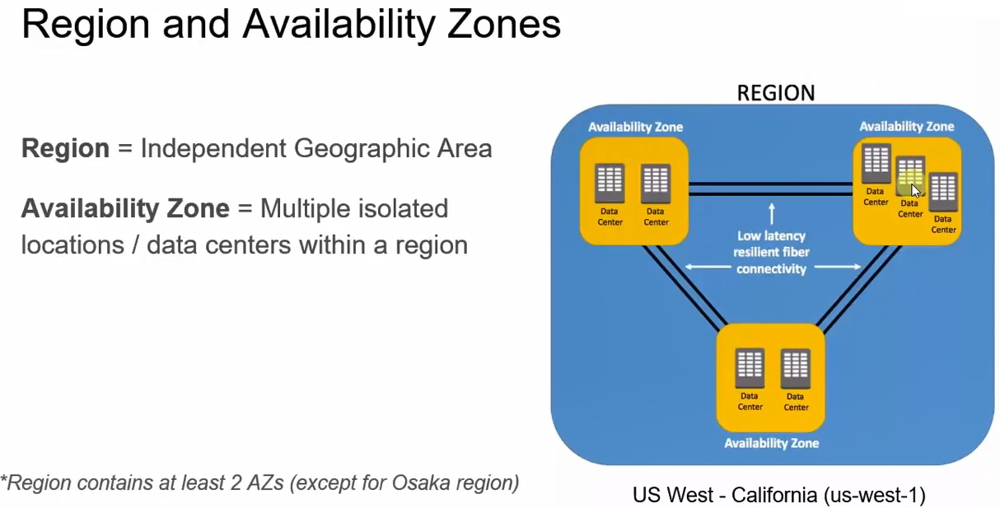
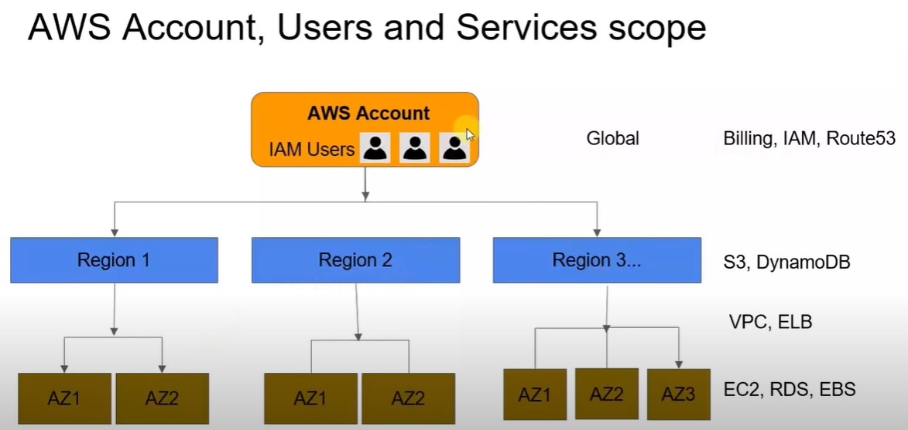
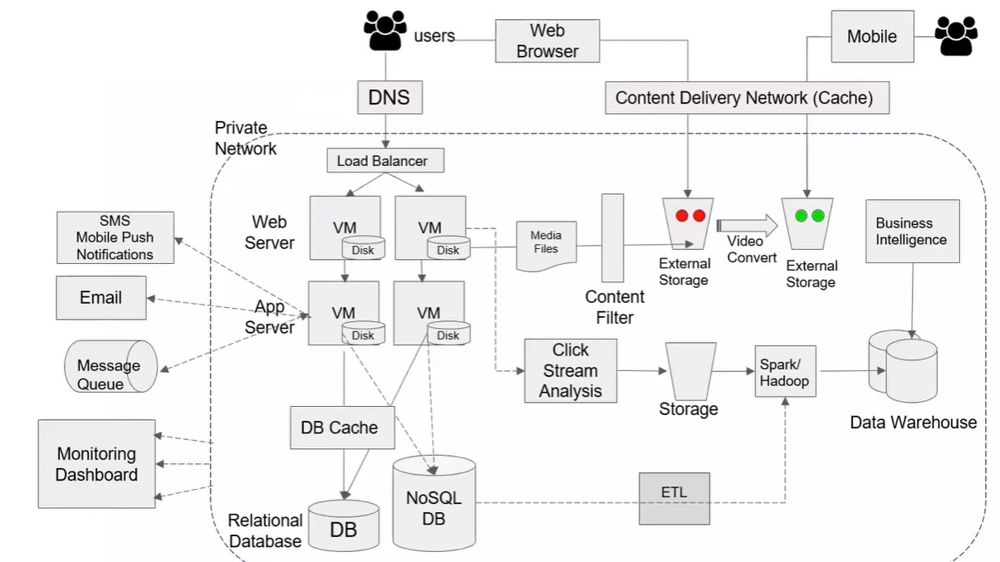
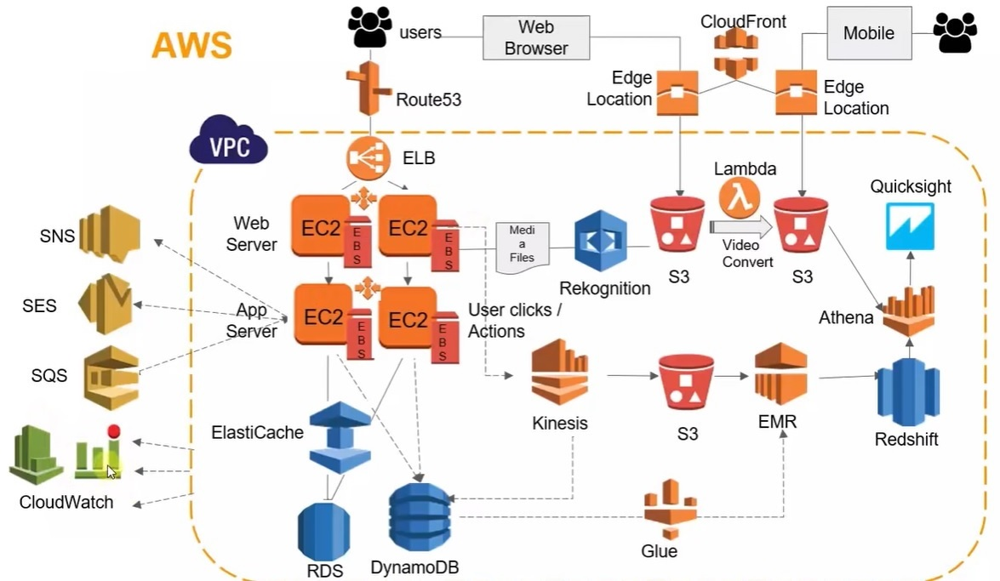

# Introduction to AWS services
## AWS Global Data Centers
* `AWS Region`: Whenever we are using AWS services typically we deploy our application in AWS geographical area. That geographical area is called `AWS Regions`
* Across world there are different AWS regions available
* When we deploy services, we can choose which regions we need to deploy
* `Data Centers`: Every region contains - 2 or more data centers for high availability of AWS services
* `Availability Zones`: 2 or more data centers are called availability zones
* `Edge Locations`: Used for caching. Our content like media, videos, pictures are cached in the nearest AWS data center locations and delivered to users. It improves performance by lowering the network latency
* AWS have `130+ services` like EC2, S3 etc\

* Each `Region` will have 2 or more availability zones
* when we are deploying our application we need to keep in different availability zones so that if one of the availability zone goes down then our application still running on another availability zone. So our application will have high availability
* Services and at what level they work\

* Following services work at account level
	* Billing
	* IAM - Identity and Access Management
	* Route53
* Region level services
	* S3
	* DynamoDB
* Availability zone level
	* EC2
	* RDS
	* EBS
* General application architecture\

* Above application architecture with AWS services\
